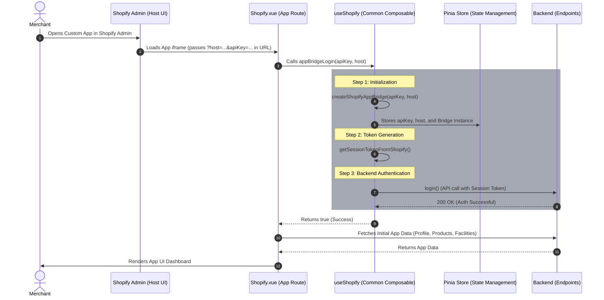

# Shopify Embedded App Integration Design

## 1. Flow Diagram

Here is the updated sequence diagram. The standalone `ShopifyService` has been removed, and its responsibilities have been absorbed directly into the `useShopify` Composable. 

The primary entry point is `appBridgeLogin`, which sequentially orchestrates creating the bridge, fetching the token, and calling the backend login API.



## 2. Design Analysis & Suggestions

By eliminating `ShopifyService` and moving everything into the `useShopify` composable, you consolidate your authentication orchestration into a single, cohesive file.

### A. Pinia State Definition (`embeddedAppStore`)

To manage common variables (like Shopify tokens, OMS identifier, and layout configs), define a dedicated Pinia store.

*Conceptual Structure of `stores/embeddedAppStore.ts`:*
```typescript
import { defineStore } from 'pinia';

export const useEmbeddedAppStore = defineStore('embeddedAppStore', {
  state: () => ({
    token: {
      value: '',
      expiration: undefined as string | number | undefined
    },
    oms: '',
    maarg: '',
    shop: '',
    apiKey: '',
    host: '',
    shopifyAppBridge: null as any
  })
});
```

### B. The `useShopify` Composable Structure

The composable handles exactly what the diagram depicts, acting as the integration layer between the Shopify context, your Pinia state, and the backend HTTP client.

*Conceptual Structure of `useShopify.ts`:*
```typescript
import { Scanner, Features, Group, Redirect } from '@shopify/app-bridge/actions';
import { embeddedApp } from "../store/embeddedAppAuth";
import { createApp } from "@shopify/app-bridge";
import { getSessionToken } from "@shopify/app-bridge-utils";
import api from '../core/remoteApi';

export function useShopify() {
  const store = embeddedApp();

  const createShopifyAppBridge = async (shop: string, host: string) => {
  try {
    if (!shop || !host) {
      throw new Error("Shop or host missing");
    }
    const apiKey = JSON.parse(import.meta.env.VITE_SHOPIFY_SHOP_CONFIG || '{}')[shop]?.apiKey;
    if (!apiKey) {
      throw new Error("Api Key not found");
    }
    const shopifyAppBridgeConfig = {
      apiKey: apiKey || '', 
      host: host || '',
      forceRedirect: false,
    };
    
    const appBridge = createApp(shopifyAppBridgeConfig);

    return Promise.resolve(appBridge);      
  } catch (error) {
    console.error(error);
    return Promise.reject(error);
  }
}

const getSessionTokenFromShopify = async (appBridgeConfig: any) => {
  try {
    if (appBridgeConfig) {
      const shopifySessionToken = await getSessionToken(appBridgeConfig);
      return Promise.resolve(shopifySessionToken);
    } else {
      throw new Error("Invalid App Config");
    }
  } catch (error) {
    return Promise.reject(error);
  }
}

const openPosScanner = (): Promise<any> => {
  return new Promise((resolve, reject) => {
    try {
      const app = store.shopifyAppBridge;

      if (!app) {
        return reject(new Error("Shopify App Bridge not initialized."));
      }

      const scanner = Scanner.create(app);
      const features = Features.create(app);

      const unsubscribeScanner = scanner.subscribe(Scanner.Action.CAPTURE, (payload) => {
        unsubscribeScanner();
        unsubscribeFeatures();
        resolve(payload?.data?.scanData);
      });

      const unsubscribeFeatures = features.subscribe(Features.Action.REQUEST_UPDATE, (payload) => {
        if (payload.feature[Scanner.Action.OPEN_CAMERA]) {
          const available = payload.feature[Scanner.Action.OPEN_CAMERA].Dispatch;
          if (available) {
            scanner.dispatch(Scanner.Action.OPEN_CAMERA);
          } else {
            unsubscribeScanner();
            unsubscribeFeatures();
            reject(new Error("Scanner feature not available."));
          }
        }
      });

      features.dispatch(Features.Action.REQUEST, {
        feature: Group.Scanner,
        action: Scanner.Action.OPEN_CAMERA
      });
    } catch(error) {
      reject(error);
    }
  });
}

  const appBridgeLogin = async (shop: string, host: string) => {
    try {
      if (!shop) shop = embeddedApp().shop
      if (!host) host = embeddedApp().host

      if (!shop || !host) {
        throw new Error("Shop or host missing");
      }
      const shopConfigsStr = import.meta.env.VITE_SHOPIFY_SHOP_CONFIG as string;
      const shopConfigs = shopConfigsStr ? JSON.parse(shopConfigsStr) : {};

      if (!shopConfigs[shop]) {
        throw new Error("Shop config not found");
      }

      const shopConfig = shopConfigs[shop as string];
      const maargUrl = shopConfig.maarg || '';

      // 1. Create Bridge
      const app = await createShopifyAppBridge(shop, host);
      
      // 2. Get Session Token
      const token = await getSessionTokenFromShopify(app);

      const appState: any = await app.getState();

      if (!appState) {
        throw new Error("Couldn't get Shopify App Bridge state, cannot proceed further.");
      }
      // Since the Shopify Admin doesn't provide location and user details,
      // we are using the app state to get the POS location and user details in case of POS Embedded Apps.
      let loginPayload: any = {};
      loginPayload.sessionToken = token;
      if (appState.pos?.location?.id) {
        loginPayload.locationId = appState.pos.location.id
      }
      if (appState.pos?.user?.firstName) {
        loginPayload.firstName = appState.pos.user.firstName;
      }
      if (appState.pos?.user?.lastName) {
        loginPayload.lastName = appState.pos.user.lastName;
      }

      store.$reset();
      
      // 3. Login API Call
      const loginResp = await api({
        url: `${maargUrl}/rest/s1/app-bridge/login`,
        method: 'post',
        data: loginPayload
      });

      if (!loginResp.data.token || !loginResp.data.omsInstanceUrl) {
        throw new Error("Couldn't get token or user from Shopify App Bridge login.");
      }

      store.$patch((state) => {
        state.token.value = loginResp.data.token;
        state.token.expiration = loginResp.data.expiresAt;
        state.oms = loginResp.data.omsInstanceUrl;
        state.maarg = maargUrl;
        state.apiKey = shopConfig.apiKey;
        state.shop = shop;
        state.host = host;
        state.shopifyAppBridge = app;
        state.posContext = {
          locationId: appState.pos?.location?.id,
          firstName: appState.pos?.user?.firstName,
          lastName: appState.pos?.user?.lastName
        };
      });

      return true;
    } catch (error) {
      console.error('Failed the Shopify App Bridge authentication flow:', error);
      return false;
    }
  };

  const redirect = (url: string) => {
    if (store.shopifyAppBridge) {
      Redirect.create(store.shopifyAppBridge).dispatch(Redirect.Action.REMOTE, url);
    }
  }

  const authorise = async (shop: string, host: string) => {
    const shopConfigsStr = import.meta.env.VITE_SHOPIFY_SHOP_CONFIG as string;
    const shopConfigs = shopConfigsStr ? JSON.parse(shopConfigsStr) : {};
    const scopes = import.meta.env.VITE_SHOPIFY_SCOPES || '';
    const shopConfig = shopConfigs[shop];
    const apiKey = shopConfig ? shopConfig.apiKey : '';
    const redirectUri = import.meta.env.VITE_SHOPIFY_REDIRECT_URI || '';
    const permissionUrl = `https://${shop}/admin/oauth/authorize?client_id=${apiKey}&scope=${scopes}&redirect_uri=${redirectUri}`;

    if (window.top == window.self) {
      window.location.assign(permissionUrl);
    } else {
      await createShopifyAppBridge(shop, host);
      redirect(permissionUrl);
    }
  };

  return {
    appBridgeLogin,
    authorise,
    createShopifyAppBridge,
    getSessionTokenFromShopify,
    openPosScanner,
    redirect
  };
}
```

### C. Route Guard vs Component Handling

Because you eliminated the `ShopifyService` singleton layer, you must ensure that whatever component or router guard invokes `appBridgeLogin` does it safely when the app loads. In `Shopify.vue`:

```typescript
import { onMounted } from 'vue';
import { useRoute } from 'vue-router';
import { useShopify } from '@accxui/common/composables/useShopify';

export default {
  setup() {
    const route = useRoute();
    const { appBridgeLogin } = useShopify();
    
    // Read from route query
    const host = route.query.host as string;
    const apiKey = route.query.apiKey as string;

    onMounted(async () => {
      // Run the composable orchestration function
      const success = await appBridgeLogin(apiKey, host);
      
      if (success) {
        // App is authenticated, fetch app-specific data
        fetchUserProfile();
        fetchProducts();
      }
    });

    return {};
  }
}
```

### D. Backend API Request Interceptor remains vital

Even though logging in is handled sequentially, remember that **all** ensuing API calls (like `fetchUserProfile` or `fetchProducts`) must also pass a fresh Session Token. 
You should still configure your backend HTTP Client (e.g., Axios) to intercept outgoing calls, reach into Pinia for the stored App Bridge instance, and call `getSessionToken(app)` on the fly, appending it to the `Authorization: Bearer` header.
