# Shopify Embedded App Integration Design

## 1. Flow Diagram

Here is the updated sequence diagram. The standalone `ShopifyService` has been removed, and its responsibilities have been absorbed directly into the `useShopify` Composable. 

The primary entry point is `appBridgeLogin`, which sequentially orchestrates creating the bridge, fetching the token, and calling the backend login API.

```mermaid
sequenceDiagram
    autonumber
    actor Merchant
    participant Shopify as Shopify Admin (Host UI)
    participant Page as Shopify.vue (App Route)
    participant Composable as useShopify (Common Composable)
    participant Store as Pinia Store (State Management)
    participant API as Backend (Endpoints)

    Merchant->>Shopify: Opens Custom App in Shopify Admin
    Shopify->>Page: Loads App iframe (passes ?host=...&apiKey=... in URL)
    Page->>Composable: Calls appBridgeLogin(apiKey, host)
    
    rect rgb(40, 44, 52)
    Note over Composable: Step 1: Initialization
    Composable->>Composable: createShopifyAppBridge(apiKey, host)
    Composable->>Store: Stores apiKey, host, and Bridge Instance
    
    Note over Composable: Step 2: Token Generation
    Composable->>Composable: getSessionTokenFromShopify()
    
    Note over Composable: Step 3: Backend Authentication
    Composable->>API: login() (API call with Session Token)
    API-->>Composable: 200 OK (Auth Successful)
    end
    
    Composable-->>Page: Returns true (Success)
    Page->>API: Fetches Initial App Data (Profile, Products, Facilities)
    API-->>Page: Returns App Data
    Page->>Merchant: Renders App UI Dashboard
```



## 2. Design Analysis & Suggestions

By eliminating `ShopifyService` and moving everything into the `useShopify` composable, you consolidate your authentication orchestration into a single, cohesive file.

### A. Pinia State Definition (`embeddedAppStore`)

To manage common variables (like Shopify tokens, OMS identifier, and layout configs), define a dedicated Pinia store.

*Conceptual Structure of `stores/embeddedAppStore.ts`:*
```typescript
import { defineStore } from 'pinia';

export const useEmbeddedAppStore = defineStore('embeddedAppStore', {
  state: () => ({
    token: {
      value: '',
      expiration: undefined as string | number | undefined
    },
    oms: '',
    maarg: '',
    apiKey: '',
    host: '',
    shopifyAppBridge: null as any
  })
});
```

### B. The `useShopify` Composable Structure

The composable handles exactly what the diagram depicts, acting as the integration layer between the Shopify context, your Pinia state, and the backend HTTP client.

*Conceptual Structure of `useShopify.ts`:*
```typescript
import { Scanner, Features, Group } from '@shopify/app-bridge/actions';
import { useEmbeddedAppStore } from "@/stores/embeddedAppStore";
import { createApp } from "@shopify/app-bridge";
import { getSessionToken } from "@shopify/app-bridge-utils";

export function useShopify() {
  const store = useEmbeddedAppStore();

  const createShopifyAppBridge = async (shop: string, host: string) => {
  try {
    if (!shop || !host) {
      throw new Error("Shop or host missing");
    }
    const apiKey = JSON.parse(process.env.VUE_APP_SHOPIFY_SHOP_CONFIG || '{}')[shop]?.apiKey;
    if (!apiKey) {
      throw new Error("Api Key not found");
    }
    const shopifyAppBridgeConfig = {
      apiKey: apiKey || '',
      host: host || '',
      forceRedirect: false,
    };
    
    const appBridge = createApp(shopifyAppBridgeConfig);

    return Promise.resolve(appBridge);      
  } catch (error) {
    console.error(error);
    return Promise.reject(error);
  }
}

const getSessionTokenFromShopify = async (appBridgeConfig: any) => {
  try {
    if (appBridgeConfig) {
      const shopifySessionToken = await getSessionToken(appBridgeConfig);
      return Promise.resolve(shopifySessionToken);
    } else {
      throw new Error("Invalid App Config");
    }
  } catch (error) {
    return Promise.reject(error);
  }
}

const openPosScanner = (): Promise<any> => {
  return new Promise((resolve, reject) => {
    try {
      const store = useEmbeddedAppStore();
      const app = store.shopifyAppBridge;

      if (!app) {
        return reject(new Error("Shopify App Bridge not initialized."));
      }

      const scanner = Scanner.create(app);
      const features = Features.create(app);

      const unsubscribeScanner = scanner.subscribe(Scanner.Action.CAPTURE, (payload) => {
        unsubscribeScanner();
        unsubscribeFeatures();
        resolve(payload?.data?.scanData);
      });

      const unsubscribeFeatures = features.subscribe(Features.Action.REQUEST_UPDATE, (payload) => {
        if (payload.feature[Scanner.Action.OPEN_CAMERA]) {
          const available = payload.feature[Scanner.Action.OPEN_CAMERA].Dispatch;
          if (available) {
            scanner.dispatch(Scanner.Action.OPEN_CAMERA);
          } else {
            unsubscribeScanner();
            unsubscribeFeatures();
            reject(new Error("Scanner feature not available."));
          }
        }
      });

      features.dispatch(Features.Action.REQUEST, {
        feature: Group.Scanner,
        action: Scanner.Action.OPEN_CAMERA
      });
    } catch(error) {
      reject(error);
    }
  });
}

  // Main Orchestrator Function
  const appBridgeLogin = async (apiKey: string, host: string) => {
    try {
      // 1. Create Bridge
      const app = createShopifyAppBridge(apiKey, host);
      
      // 2. Get Session Token
      const token = await getSessionTokenFromShopify(app);
      
      // 3. Login API Call
      await login(token);

      return true;
    } catch (error) {
      console.error('Failed the Shopify App Bridge authentication flow:', error);
      return false;
    }
  };

  return {
    appBridgeLogin,
    createShopifyAppBridge,
    getSessionTokenFromShopify,
    login,
    openPosScanner
  };
}
```

### C. Route Guard vs Component Handling

Because you eliminated the `ShopifyService` singleton layer, you must ensure that whatever component or router guard invokes `appBridgeLogin` does it safely when the app loads. In `Shopify.vue`:

```typescript
import { onMounted } from 'vue';
import { useRoute } from 'vue-router';
import { useShopify } from '@accxui/common/composables/useShopify';

export default {
  setup() {
    const route = useRoute();
    const { appBridgeLogin } = useShopify();
    
    // Read from route query
    const host = route.query.host as string;
    const apiKey = route.query.apiKey as string;

    onMounted(async () => {
      // Run the composable orchestration function
      const success = await appBridgeLogin(apiKey, host);
      
      if (success) {
        // App is authenticated, fetch app-specific data
        fetchUserProfile();
        fetchProducts();
      }
    });

    return {};
  }
}
```

### D. Backend API Request Interceptor remains vital

Even though logging in is handled sequentially, remember that **all** ensuing API calls (like `fetchUserProfile` or `fetchProducts`) must also pass a fresh Session Token. 
You should still configure your backend HTTP Client (e.g., Axios) to intercept outgoing calls, reach into Pinia for the stored App Bridge instance, and call `getSessionToken(app)` on the fly, appending it to the `Authorization: Bearer` header.
