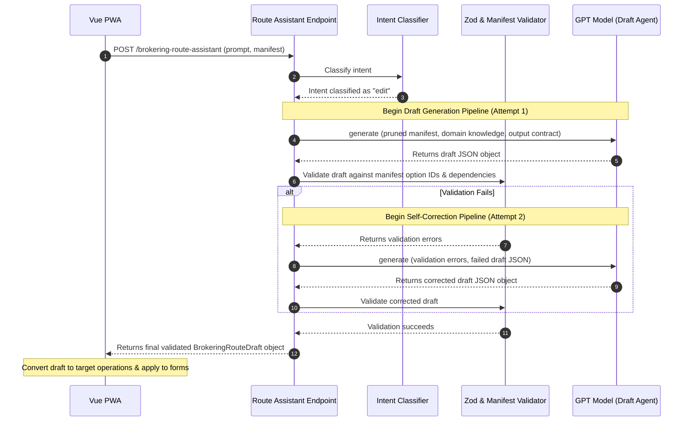
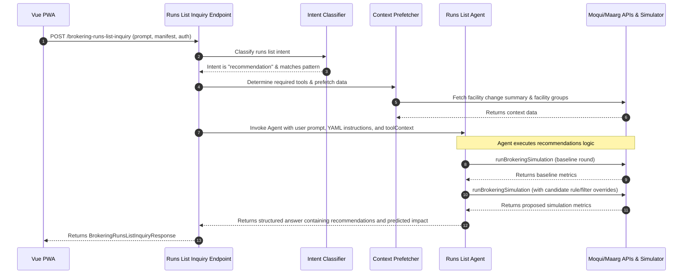

# Mastra Integration Guide: HotWax Commerce Order Routing

This guide provides a comprehensive overview of how **Mastra** (an agentic LLM orchestration framework) is integrated into the `order-routing` project. It covers the core features, directory structure, agent control files, tool bindings, and data flow pipelines to help you master this architecture as quickly as possible.

---

## 1. Overview & Architectural Goals

The `@/Users/banibratamanna/Work/PWApps/Reg/accxui/apps/order-routing` project is a Vue + Ionic Progressive Web App (PWA) designed to configure the **HotWax Commerce Order Routing (Brokering) Engine**. 

Mastra is integrated to power two intelligent assistant interfaces within the application:
1. **Interactive Brokering Route Editor Assistant** (`/brokering-route-assistant`): Helps merchants modify routing rules, queues, sorting parameters, and exclusions using natural language.
2. **Brokering Runs List Assistant** (`/brokering-runs-list-inquiry`): Answers queries about scheduled runs, diagnoses fulfillment bottlenecks (like unfillable orders), and simulates predicted impacts of proposed changes.

### Key Architectural Concepts
* **Declarative Page Capability Manifest**: Instead of parsing arbitrary text, the frontend PWA supplies the assistant with a [PageCapabilityManifest](file:///Users/banibratamanna/Work/PWApps/Reg/accxui/apps/order-routing/mastra/pageCapabilitySchema.ts) that defines:
  * `visibleEntities`: The current state of the page (routing schedules, rules, etc.).
  * `editableTargets`: Specific fields that can be edited, their options, constraints, dependencies, and disabled states.
  * `outputContract`: The expected response shape.
* **Strict Schema Enforcements (Zod)**: All inputs and outputs between the PWA and the Mastra endpoints are strictly validated using Zod schemas. The agent returns a structured JSON draft rather than raw text.
* **Validation & Self-Correction Pipeline**: The assistant uses a validator that runs business rules against the manifest (e.g., verifying that option IDs are valid). If the LLM generates an invalid draft, the pipeline performs up to 2 self-correction attempts, feeding the validation errors back to the LLM to fix specific fields.
* **Predictive What-If Simulations**: The runs list assistant connects directly to Maarg/OMS APIs using Mastra tools. It can run backend-powered simulations to predict the impact of changing safety stock, ship distances, or facility caps before the merchant applies the changes to production.

---

## 2. Directory Structure

The Mastra integration lives entirely under the [mastra](file:///Users/banibratamanna/Work/PWApps/Reg/accxui/apps/order-routing/mastra) directory. Below is the directory tree:

```
apps/order-routing/mastra/
├── index.ts                           # Main entry point: sets up server, routes, and agents
├── env.ts                             # Environmental helper for Node + Vite bundlers
├── pageCapabilitySchema.ts            # Zod schemas for the frontend page capability manifest
├── manifestUtils.ts                   # Utilities to prune manifest size for LLM context optimization
├── orderRoutingDomainKnowledge.ts     # YAML parser for domain ontology & diagnostic patterns
├── runsListInquiryContext.ts          # Logic to determine and prefetch tools based on intent
├── brokeringRouteIntent.ts            # LLM intent classifier (Edit vs. Inquiry)
├── brokeringRouteIntentFallback.ts    # Dictionary-based fallback classifier
├── brokeringRouteAssistantRouting.ts  # Orchestrates routing assistant inquiry vs. draft logic
├── brokeringRouteDraftSchema.ts       # Structured output Zod schema & normalizers for drafts
├── brokeringRouteDraftValidator.ts   # Core business logic validator for generated drafts
├── brokeringRouteDraftGeneration.ts  # Multi-attempt draft generation with self-correction
├── brokeringRunsListInquirySchema.ts  # Schemas for runs list inquiry inputs and outputs
├── brokeringRunsListIntent.ts         # Intent classifier for runs list inquiry
├── public/
│   └── knowledge/
│       └── hotwax_order_routing_domain_knowledge.yaml # Ontology, rules, goals, and diagnostic patterns
└── tools/                             # API integrations called by the runs list agent
    ├── getBrokeringFacilityGroups.ts  # Fetches configured facility groups and members
    ├── getBrokeringSimulationStatus.ts# Polls async simulation job status
    ├── getFacilityChangeSummary.ts    # Fetches decisions log (rejection reasons, comments)
    ├── getFacilityOrderLimits.ts      # Fetches maximum order capacity limits
    ├── getProductStoreBrokeringSettings.ts # Fetches store-level brokering thresholds
    ├── runBrokeringSimulation.ts      # Submits, polls, and gathers simulated impact metrics
    └── submitBrokeringSimulation.ts   # Submits a simulation run asynchronously
```

---

## 3. Core Agents & Orchestration

The integration revolves around four Mastra `Agent` instances defined and registered in [index.ts](file:///Users/banibratamanna/Work/PWApps/Reg/accxui/apps/order-routing/mastra/index.ts):

1. **`brokeringRouteDraftAgent`**: Generates a structured JSON object representing route modifications.
2. **`brokeringRouteInquiryAgent`**: Answers questions about the open route and selected rule from manifest details.
3. **`brokeringRunsListInquiryAgent`**: Answers diagnostic questions and suggests configurations for the Brokering Runs list page.
4. **`brokeringRouteIntentAgent`**: Classifies prompts on the Route Editor into `edit` or `inquiry` modes.

### Registered API Routes
Mastra runs a local server (default port `4111`) and registers the following endpoints using Hono (`registerApiRoute`):

#### 1. `/brokering-route-assistant` (POST)
* **Purpose**: Orchestrates editing and inquiry on the route level.
* **Flow**:
  1. Classifies the query using `classifyBrokeringRouteIntent`.
  2. If the intent is `inquiry`, prunes the manifest and passes it to the `brokeringRouteInquiryAgent` via `callStructured`.
  3. If the intent is `edit`, invokes `generateValidatedBrokeringRouteDraft` to build and validate the draft.

#### 2. `/brokering-runs-list-inquiry` (POST)
* **Purpose**: Audits runs, ranks rule impacts, and issues simulator-backed suggestions.
* **Flow**:
  1. Classifies the query into `config_lookup`, `behavior_diagnostic`, `environmental_audit`, or `recommendation` using `classifyRunsListIntent`.
  2. Resolves which tools are required based on the intent and matches them against patterns in the YAML file.
  3. Prefetches required tool contexts (e.g. facility change summaries) using `prefetchToolContext`.
  4. Generates a structured answer using the `brokeringRunsListInquiryAgent`, which has access to the OMS API tools.

#### 3. `/brokering-route-draft` (POST)
* **Purpose**: Directly triggers a route draft generation loop with validation.

---

## 4. Intent Classification & Fallbacks

To minimize LLM token usage and prevent the agent from making unnecessary tool calls, incoming requests are classified before the main agent runs.

### Route Editor Intent Classification
* **LLM Classifier**: [brokeringRouteIntent.ts](file:///Users/banibratamanna/Work/PWApps/Reg/accxui/apps/order-routing/mastra/brokeringRouteIntent.ts) checks the prompt and the last 6 turns of history, returning either `"edit"` or `"inquiry"`.
* **Dictionary Fallback**: If the OpenAI API key is missing or the request times out, `index.ts` uses [brokeringRouteIntentFallback.ts](file:///Users/banibratamanna/Work/PWApps/Reg/accxui/apps/order-routing/mastra/brokeringRouteIntentFallback.ts). It checks for explicit imperative verbs like `add`, `remove`, `enable`, `disable`, `set`, `clear`, `delete`, or `create`. If none match, it defaults to `"inquiry"` to prevent accidental modifications.

### Runs List Intent Classification
* Defined in [brokeringRunsListIntent.ts](file:///Users/banibratamanna/Work/PWApps/Reg/accxui/apps/order-routing/mastra/brokeringRunsListIntent.ts). It splits queries into:
  * `config_lookup`: Answerable using only the page capability manifest.
  * `behavior_diagnostic`: Requires decisions logs (`facility_change_summary`).
  * `environmental_audit`: Requires store configurations, limits, or group listings.
  * `recommendation`: Requires simulation-backed diagnostic analysis.

---

## 5. Draft Generation & Validation Pipeline

When editing a route, the agent must output a structured JSON that matches the [brokeringRouteDraftSchema](file:///Users/banibratamanna/Work/PWApps/Reg/accxui/apps/order-routing/mastra/brokeringRouteDraftSchema.ts).

### Multi-Attempt Self-Correction Loop
Implemented in [brokeringRouteDraftGeneration.ts](file:///Users/banibratamanna/Work/PWApps/Reg/accxui/apps/order-routing/mastra/brokeringRouteDraftGeneration.ts):
1. **Pruning**: The manifest is pruned using `pruneManifestForDraft` to reduce tokens (stripping static-disabled targets and keeping only essential routing details).
2. **Attempt 1**: The LLM generates a structured output representing the draft.
3. **Validation**: The JSON is validated against the schema and run through [brokeringRouteDraftValidator.ts](file:///Users/banibratamanna/Work/PWApps/Reg/accxui/apps/order-routing/mastra/brokeringRouteDraftValidator.ts). The validator enforces business rules, such as:
   * Ensuring option IDs match valid values from the manifest.
   * Restricting edits to editable targets.
   * Enforcing dependencies (e.g. proximity measurement system is required if max distance is set).
   * Checking that partial allocation rules do not overlap invalidly.
4. **Attempt 2 (Correction)**: If validation fails, the validator's error issues and the failed draft are packaged into `previousValidationFailure` and sent back to the LLM. The LLM corrects the specific fields and returns the final draft.

### Frontend Application
The frontend Ionic Vue app calls `requestBrokeringRouteDraftOperations` in [DraftAssistantService.ts](file:///Users/banibratamanna/Work/PWApps/Reg/accxui/apps/order-routing/src/services/DraftAssistantService.ts). It converts the returned structured draft into an array of fine-grained operations (e.g., `{ op: "set", target: "route.statusId", value: "ROUTING_DRAFT" }`) which are applied to the PWA editor forms.

---

## 6. Runs List Inquiry & Rejection Diagnosis

The [brokeringRunsListInquiryAgent](file:///Users/banibratamanna/Work/PWApps/Reg/accxui/apps/order-routing/mastra/index.ts#L195-L199) uses a local domain ontology and diagnostic patterns to answer questions and formulate recommendations.

### Domain Knowledge YAML
The knowledge is stored in [hotwax_order_routing_domain_knowledge.yaml](file:///Users/banibratamanna/Work/PWApps/Reg/accxui/apps/order-routing/mastra/public/knowledge/hotwax_order_routing_domain_knowledge.yaml). It includes:
* **Ontology**: Explanations of runs, rules, QOH, ATP, BOPIS, and allocation.
* **Sequencing Patterns**: Best practice rule orders (e.g., checking warehouses first, then stores, and enabling partial allocation only in the final rule).
* **Diagnostic Patterns**: Structured workflows with matching symptoms. For example, `high_unfillable_rate` defines:
  * Levers (group breadth, thresholds, safety stock, facility caps).
  * Appropriate and forbidden clarifying questions.
  * Recommendation templates.
  * **Rejection Diagnoses**: Conditions that map symptoms to likely causes and suggest specific configuration fixes.

### Prefetching and Simulator Flow
1. The assistant classifies the intent. If it is `recommendation`, it matches the query against the YAML diagnostic patterns.
2. It prefetches background context using [runsListInquiryContext.ts](file:///Users/banibratamanna/Work/PWApps/Reg/accxui/apps/order-routing/mastra/runsListInquiryContext.ts).
3. The agent is called. The system instructions require that **any recommendation must be backed by a simulation run**.
4. The agent:
   * Analyzes the decisions log (`getFacilityChangeSummary`) to attribute unfillable orders to specific rules.
   * Calls `runBrokeringSimulation` to fetch the baseline metrics.
   * Formulates a candidate fix, runs a simulation with that override, and extracts the predicted impact (e.g., "+23 orders routed, backorder rate reduced by 8%").
   * Presents the recommendation with explicit predicted impact figures.

---

## 7. Mastra Tools (`mastra/tools`)

Mastra tools represent the bridge to the HotWax Moqui/Maarg REST API. They are configured dynamically with the user's `authToken` and `omsBaseUrl` in [index.ts](file:///Users/banibratamanna/Work/PWApps/Reg/accxui/apps/order-routing/mastra/index.ts#L349-L362):

| Tool Name | File Path | Description |
| :--- | :--- | :--- |
| `getFacilityChangeSummary` | [getFacilityChangeSummary.ts](file:///Users/banibratamanna/Work/PWApps/Reg/accxui/apps/order-routing/mastra/tools/getFacilityChangeSummary.ts) | Fetches aggregate order destination logs, rejection counts, and error comments over a window. |
| `getBrokeringFacilityGroups` | [getBrokeringFacilityGroups.ts](file:///Users/banibratamanna/Work/PWApps/Reg/accxui/apps/order-routing/mastra/tools/getBrokeringFacilityGroups.ts) | Returns brokering facility groups and their member facilities. |
| `getProductStoreBrokeringSettings` | [getProductStoreBrokeringSettings.ts](file:///Users/banibratamanna/Work/PWApps/Reg/accxui/apps/order-routing/mastra/tools/getProductStoreBrokeringSettings.ts) | Fetches product store-level settings (e.g. shipment split thresholds). |
| `getFacilityOrderLimits` | [getFacilityOrderLimits.ts](file:///Users/banibratamanna/Work/PWApps/Reg/accxui/apps/order-routing/mastra/tools/getFacilityOrderLimits.ts) | Fetches maximum daily order caps set on stores and warehouses. |
| `runBrokeringSimulation` | [runBrokeringSimulation.ts](file:///Users/banibratamanna/Work/PWApps/Reg/accxui/apps/order-routing/mastra/tools/runBrokeringSimulation.ts) | **Synchronous Simulator**: Submits a what-if configuration override, polls the job until completion, and returns the comparative impact metrics. |
| `submitBrokeringSimulation` | [submitBrokeringSimulation.ts](file:///Users/banibratamanna/Work/PWApps/Reg/accxui/apps/order-routing/mastra/tools/submitBrokeringSimulation.ts) | **Asynchronous Simulator**: Submits a simulation job and returns the `jobId`. |
| `getBrokeringSimulationStatus` | [getBrokeringSimulationStatus.ts](file:///Users/banibratamanna/Work/PWApps/Reg/accxui/apps/order-routing/mastra/tools/getBrokeringSimulationStatus.ts) | Checks the status and retrieves the results of an async simulation job. |

---

## 8. End-to-End Execution Flows

### Interactive Route Editor Assistant Flow (Drafts)



### Runs List Assistant Flow (Recommendations)



---

## 9. Key Developer Commands & Environment Configuration

### Running Locally
To launch the local Mastra agent server during PWA development, run:
```bash
npm run mastra:dev
```
This runs the Hono server under Node using the `--dir mastra` configuration, serving endpoints on port `4111`.

To build the Mastra bundle for production:
```bash
npm run mastra:build
```

### Environment Variables
Ensure these keys are configured in your local `.env` or system environment:
* `OPENAI_API_KEY`: Required to authenticate with the OpenAI model provider.
* `VITE_MASTRA_MODEL`: Defines the LLM model to use for core agents (e.g. `openai/gpt-4.1-mini`).
* `VITE_MASTRA_INTENT_MODEL`: Defines the model for intent classification (e.g. `openai/gpt-4.1-nano`).
* `VITE_MASTRA_PORT`: Custom port for the server (defaults to `4111`).
* `VITE_MASTRA_ALLOWED_ORIGIN`: CORS origin restriction (defaults to `*`).
* `VITE_ORDER_ROUTING_KNOWLEDGE_DIR`: Custom path to load domain knowledge YAML (optional).

---

## 10. Code Cheat Sheet: Quick Reference & Sources

Use this section as a quick reference map to locate agents, tools, schemas, and front-end integration points for debug checks.

### Agents & Server Config
* **Global Server Entry & Hono Route Handlers**: [mastra/index.ts](file:///Users/banibratamanna/Work/PWApps/Reg/accxui/apps/order-routing/mastra/index.ts)
* **Agent Registrations & Model Configs**: [mastra/index.ts#L181-L213](file:///Users/banibratamanna/Work/PWApps/Reg/accxui/apps/order-routing/mastra/index.ts#L181-L213)
* **API Route Implementations**:
  * `/brokering-route-assistant`: [mastra/index.ts#L221-L315](file:///Users/banibratamanna/Work/PWApps/Reg/accxui/apps/order-routing/mastra/index.ts#L221-L315)
  * `/brokering-runs-list-inquiry`: [mastra/index.ts#L317-L486](file:///Users/banibratamanna/Work/PWApps/Reg/accxui/apps/order-routing/mastra/index.ts#L317-L486)
  * `/brokering-route-draft`: [mastra/index.ts#L488-L530](file:///Users/banibratamanna/Work/PWApps/Reg/accxui/apps/order-routing/mastra/index.ts#L488-L530)
* **Local environment reader helper**: [mastra/env.ts](file:///Users/banibratamanna/Work/PWApps/Reg/accxui/apps/order-routing/mastra/env.ts)

### Intent & Fallback Parsers
* **Route Editor Intent Classifier**: [mastra/brokeringRouteIntent.ts](file:///Users/banibratamanna/Work/PWApps/Reg/accxui/apps/order-routing/mastra/brokeringRouteIntent.ts)
* **Dictionary Fallback Intent Tokenizer**: [mastra/brokeringRouteIntentFallback.ts](file:///Users/banibratamanna/Work/PWApps/Reg/accxui/apps/order-routing/mastra/brokeringRouteIntentFallback.ts)
* **Runs List Intent Classifier**: [mastra/brokeringRunsListIntent.ts](file:///Users/banibratamanna/Work/PWApps/Reg/accxui/apps/order-routing/mastra/brokeringRunsListIntent.ts)

### Validation & Generation Pipeline
* **Multi-Attempt Self-Correction Loop**: [mastra/brokeringRouteDraftGeneration.ts](file:///Users/banibratamanna/Work/PWApps/Reg/accxui/apps/order-routing/mastra/brokeringRouteDraftGeneration.ts)
* **Strict Zod Schema Declarations**: [mastra/brokeringRouteDraftSchema.ts](file:///Users/banibratamanna/Work/PWApps/Reg/accxui/apps/order-routing/mastra/brokeringRouteDraftSchema.ts)
* **Cross-field Business Rule Validator**: [mastra/brokeringRouteDraftValidator.ts](file:///Users/banibratamanna/Work/PWApps/Reg/accxui/apps/order-routing/mastra/brokeringRouteDraftValidator.ts)
* **Manifest Pruner**: [mastra/manifestUtils.ts](file:///Users/banibratamanna/Work/PWApps/Reg/accxui/apps/order-routing/mastra/manifestUtils.ts)

### Ontology & Knowledge Excerpts
* **Knowledge YAML Database**: [mastra/public/knowledge/hotwax_order_routing_domain_knowledge.yaml](file:///Users/banibratamanna/Work/PWApps/Reg/accxui/apps/order-routing/mastra/public/knowledge/hotwax_order_routing_domain_knowledge.yaml)
* **YAML Parser & Pattern Loader**: [mastra/orderRoutingDomainKnowledge.ts](file:///Users/banibratamanna/Work/PWApps/Reg/accxui/apps/order-routing/mastra/orderRoutingDomainKnowledge.ts)
* **Tool Context Prefetching orchestrator**: [mastra/runsListInquiryContext.ts](file:///Users/banibratamanna/Work/PWApps/Reg/accxui/apps/order-routing/mastra/runsListInquiryContext.ts)

### Agent Tool implementations
All tools live in [mastra/tools/](file:///Users/banibratamanna/Work/PWApps/Reg/accxui/apps/order-routing/mastra/tools):
* **Fulfillment Decisions Log**: [tools/getFacilityChangeSummary.ts](file:///Users/banibratamanna/Work/PWApps/Reg/accxui/apps/order-routing/mastra/tools/getFacilityChangeSummary.ts)
* **Fulfillment Facility Groups**: [tools/getBrokeringFacilityGroups.ts](file:///Users/banibratamanna/Work/PWApps/Reg/accxui/apps/order-routing/mastra/tools/getBrokeringFacilityGroups.ts)
* **Product Store Thresholds**: [tools/getProductStoreBrokeringSettings.ts](file:///Users/banibratamanna/Work/PWApps/Reg/accxui/apps/order-routing/mastra/tools/getProductStoreBrokeringSettings.ts)
* **Store Daily Caps**: [tools/getFacilityOrderLimits.ts](file:///Users/banibratamanna/Work/PWApps/Reg/accxui/apps/order-routing/mastra/tools/getFacilityOrderLimits.ts)
* **Simulate Order Brokering (Sync)**: [tools/runBrokeringSimulation.ts](file:///Users/banibratamanna/Work/PWApps/Reg/accxui/apps/order-routing/mastra/tools/runBrokeringSimulation.ts)
* **Trigger Simulation (Async)**: [tools/submitBrokeringSimulation.ts](file:///Users/banibratamanna/Work/PWApps/Reg/accxui/apps/order-routing/mastra/tools/submitBrokeringSimulation.ts)
* **Get Simulation Job Status**: [tools/getBrokeringSimulationStatus.ts](file:///Users/banibratamanna/Work/PWApps/Reg/accxui/apps/order-routing/mastra/tools/getBrokeringSimulationStatus.ts)

### Frontend Service Connectors
* **Draft Assistant Service API**: [src/services/DraftAssistantService.ts](file:///Users/banibratamanna/Work/PWApps/Reg/accxui/apps/order-routing/src/services/DraftAssistantService.ts)
* **Inquiry Assistant Service API**: [src/services/BrokeringRunsAssistantService.ts](file:///Users/banibratamanna/Work/PWApps/Reg/accxui/apps/order-routing/src/services/BrokeringRunsAssistantService.ts)

### PWA UI Vue Components
* **Route Editor Canvas (Drafts interface)**: [src/components/circuit/CircuitCanvas.vue](file:///Users/banibratamanna/Work/PWApps/Reg/accxui/apps/order-routing/src/components/circuit/CircuitCanvas.vue)
* **Brokering Runs List Assistant Modal**: [src/components/BrokeringRunsAssistantModal.vue](file:///Users/banibratamanna/Work/PWApps/Reg/accxui/apps/order-routing/src/components/BrokeringRunsAssistantModal.vue)

